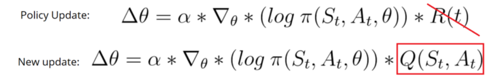

### Actor-Critic
> Actor-Critic structure Sequential Decision

#### Theory

- a Critic that measures how good the action taken is (value-based)
- an Actor that controls how our agent behaves (policy-based)

Instead of waiting until the end of episode as we do in Monte Carlo REINFORCE, we make an update at each step(**TD Learning**)

结合了 Policy Gradient (Actor) 和 Function Approximation (Critic) 的方法. `Actor` 基于概率选行为, `Critic` 基于 `Actor` 的行为评判行为的得分, `Actor` 根据 `Critic` 的评分修改选行为的概率，输入的单次奖赏变成了critic输出的总奖赏增量td-error。critic建立s-Q的网络，然后根据[s, r, s_]来训练，并返回td-error。
 

**优势**：可以进行单步更新, 比传统的 Policy Gradient 要快.

**劣势**：取决于 Critic 的价值判断, 但是 Critic 难收敛, 再加上 Actor 的更新, 就更难收敛. 为了解决收敛问题, Google Deepmind 提出了 `Actor Critic` 升级版 `Deep Deterministic Policy Gradient`. 后者融合了 DQN 的优势, 解决了收敛难的问题. 