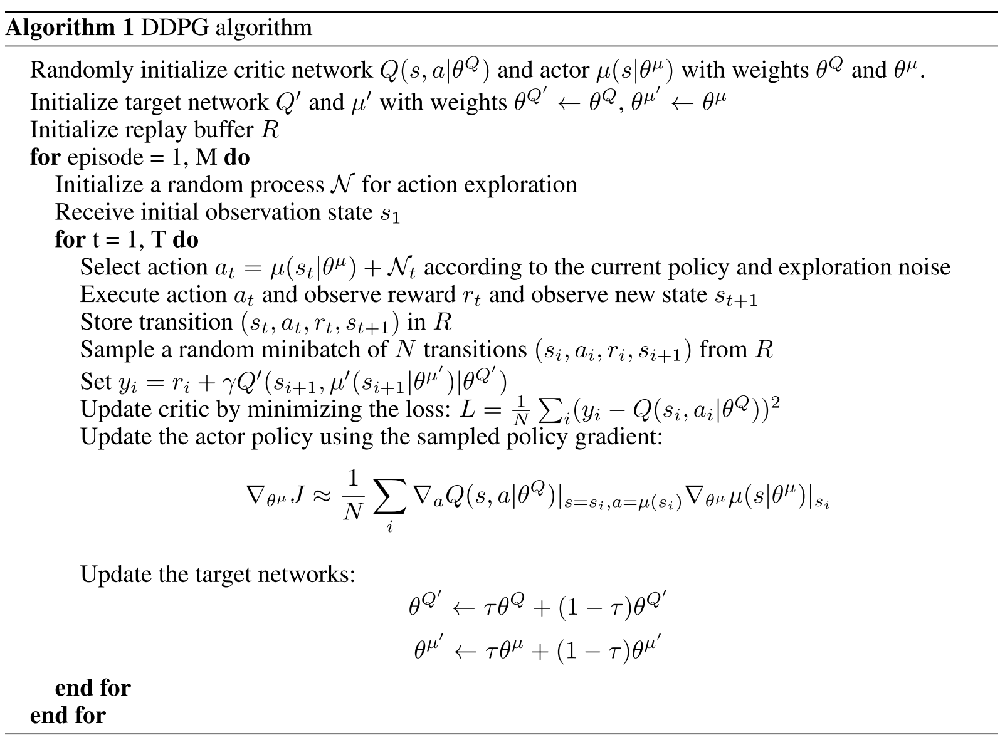

# Deep Deterministic Policy Gradient (DDPG)

## DDPG
> - off-policy
> - continuous action spaces.
> - Actor-Critic structure Sequential Decision
### Principle
**DDPG 简单来说就是 DQN + Actor-Critic**

`DDPG` 结合了之前获得成功的 `DQN` 结构, 提高了 `Actor-Critic` 的稳定性和收敛性。为了体现`DQN`的思想，每种神经网络都需要再细分为两个， 

- `Actor`有估计网络和现实网络，估计网络用来输出实时的动作, 供actor在现实中实行。而现实网络则是用来更新价值网络系统的。
- `Critic`这边也有现实网络和估计网络，他们都在输出这个状态的价值，而输入端却有不同，状态现实网络这边会拿着从动作现实网络来的动作加上状态的观测值加以分析，而状态估计网络则是拿着当时Actor施加的动作当作输入。

### Pseudocode


### Advantage

off-policy -> sample efficient

### Disadvantage

If the Q-function approximator develops an incorrect sharp peak for some actions, the policy will quickly exploit that peak and then have brittle or incorrect behavior. 

### Implement
```
class Actor(nn.Module):
    def __init__(self, input_size, hidden_size, output_size):
        super(Actor, self).__init__()
        self.linear1 = nn.Linear(input_size, hidden_size)
        self.linear2 = nn.Linear(hidden_size, hidden_size)
        self.linear3 = nn.Linear(hidden_size, output_size)
        
    def forward(self, s):
        x = F.relu(self.linear1(s))
        x = F.relu(self.linear2(x))
        x = torch.tanh(self.linear3(x))

        return x


class Critic(nn.Module):
    def __init__(self, input_size, hidden_size, output_size):
        super().__init__()
        self.linear1 = nn.Linear(input_size, hidden_size)
        self.linear2 = nn.Linear(hidden_size, hidden_size)
        self.linear3 = nn.Linear(hidden_size, output_size)

    def forward(self, s, a):
        x = torch.cat([s, a], 1)
        x = F.relu(self.linear1(x))
        x = F.relu(self.linear2(x))
        x = self.linear3(x)

        return x


class Skylark_DDPG():
    def __init__(self, env):
        self.env = env
        self.gamma = 0.99
        self.actor_lr = 0.001
        self.critic_lr = 0.001
        self.tau = 0.02
        self.capacity = 10000
        self.batch_size = 32

        s_dim = self.env.observation_space.shape[0]
        a_dim = self.env.action_space.shape[0]

        self.actor = Actor(s_dim, 256, a_dim)
        self.actor_target = Actor(s_dim, 256, a_dim)
        self.critic = Critic(s_dim+a_dim, 256, a_dim)
        self.critic_target = Critic(s_dim+a_dim, 256, a_dim)
        self.actor_optim = optim.Adam(self.actor.parameters(), lr = self.actor_lr)
        self.critic_optim = optim.Adam(self.critic.parameters(), lr = self.critic_lr)
        self.buffer = []
        
        self.actor_target.load_state_dict(self.actor.state_dict())
        self.critic_target.load_state_dict(self.critic.state_dict())
        
    def act(self, s0):
        s0 = torch.tensor(s0, dtype=torch.float).unsqueeze(0)
        a0 = self.actor(s0).squeeze(0).detach().numpy()

        return a0
    
    def put(self, *transition): 
        if len(self.buffer)== self.capacity:
            self.buffer.pop(0)
        self.buffer.append(transition)
    
    def learn(self):
        if len(self.buffer) < self.batch_size:
            return 
        
        samples = random.sample(self.buffer, self.batch_size)
        
        s0, a0, r1, s1 = zip(*samples)
        
        s0 = torch.tensor(s0, dtype=torch.float)
        a0 = torch.tensor(a0, dtype=torch.float)
        r1 = torch.tensor(r1, dtype=torch.float).view(self.batch_size,-1)
        s1 = torch.tensor(s1, dtype=torch.float)
        
        def critic_learn():
            a1 = self.actor_target(s1).detach()
            y_true = r1 + self.gamma * self.critic_target(s1, a1).detach()
            
            y_pred = self.critic(s0, a0)
            
            loss_fn = nn.MSELoss()
            loss = loss_fn(y_pred, y_true)
            self.critic_optim.zero_grad()
            loss.backward()
            self.critic_optim.step()
            
        def actor_learn():
            loss = -torch.mean( self.critic(s0, self.actor(s0)) )
            self.actor_optim.zero_grad()
            loss.backward()
            self.actor_optim.step()
                                           
        def soft_update(net_target, net, tau):
            for target_param, param  in zip(net_target.parameters(), net.parameters()):
                target_param.data.copy_(target_param.data * (1.0 - tau) + param.data * tau)
    
        critic_learn()
        actor_learn()
        soft_update(self.critic_target, self.critic, self.tau)
        soft_update(self.actor_target, self.actor, self.tau)
                                           
    def train(self, num_episodes):
        for i in range(1, num_episodes):
            s0 = self.env.reset()
            episode_reward = 0
            
            for t in range(1, 1000):
                # self.env.render()
                a0 = self.act(s0)
                s1, r1, done, _ = self.env.step(a0)
                self.put(s0, a0, r1, s1)

                episode_reward += r1 
                s0 = s1

                self.learn()

            print('Episode {} : {}'.format(i, episode_reward))
```

## TD3 (Twin Delayed DDPG)
> - off-policy
> - only continuous action spaces
> - Actor-Critic structure Sequential Decision

### Principle 
尽管DDPG有时可以实现出色的性能，但它在超参数和其他类型的调整方面通常很脆弱。 
DDPG的常见问题在于，学习到的Q函数对Q值的过估计。然后导致策略中断，因为它利用了Q函数中的错误。
双延迟DDPG（TD3）是一种通过引入三个关键tricks来解决此问题的算法：

- Clipped Double-Q Learning：跟Double DQN 解决Q值过估计的做法一样，学习两个Q-functions而不是一个（这也是名字里"twin"的由来），并使用两个Q值中较小的一个来做Bellman损失函数中的target；
- “Delayed” Policy Updates：TD3的策略以及target networks的更新频率低于Q-functions，由于一次策略更新会改变target，延缓更新有助于缓解DDPG中通常出现的波动性。**建议每两个Q-func更新进行一次策略更新**；
- Target Policy Smoothing：TD3会给target action增加噪声，从而通过沿动作变化平滑Q来使策略更难利用Q-func的error。

**target policy smoothing**:

构成Q-learning target的action是基于target policy $\mu_{\theta_{targ}}$ 的，TD3在action的每个维度上都添加了clipped noise，从而使target action将被限定在有效动作范围内(all valid actions, $a$, satisfy $a_{Low} \leq a \leq a_{High}$)。因此，target actions写作：

$$a^{\prime}\left(s^{\prime}\right)=\operatorname{clip}\left(\mu_{\theta_{\mathrm{targ}}}\left(s^{\prime}\right)+\operatorname{clip}(\epsilon,-c, c), a_{L o w}, a_{H i g h}\right), \quad \epsilon \sim \mathcal{N}(0, \sigma)$$

target policy smoothing实质上是算法的**正则化器**。
它解决了DDPG中可能发生的特定故障：如果Q函数逼近器为某些操作产生了不正确的尖峰，该策略将迅速利用该峰，并出现脆性或错误行为。
可以通过在类似action上使Q函数变得平滑来修正，即target policy smoothing。

**clipped double-Q learning**:
两个Q函数都使用一个目标，使用两个Q函数中的任何一个计算得出的目标值都较小：

$$y\left(r, s^{\prime}, d\right)=r+\gamma(1-d) \min _{i=1,2} Q_{\phi_{i, \text { targ }}}\left(s^{\prime}, a^{\prime}\left(s^{\prime}\right)\right)$$

然后通过回归此目标来学习两者：

$$\begin{array}{l}
L\left(\phi_{1}, \mathcal{D}\right)=\underset{\left(s, a, r, s^{\prime}, d\right) \sim \mathcal{D}}{\mathrm{E}}\left[\left(Q_{\phi_{1}}(s, a)-y\left(r, s^{\prime}, d\right)\right)^{2}\right] \\
L\left(\phi_{2}, \mathcal{D}\right)=\underset{\left(s, a, r, s^{\prime}, d\right) \sim \mathcal{D}}{\mathrm{E}}\left[\left(Q_{\phi_{2}}(s, a)-y\left(r, s^{\prime}, d\right)\right)^{2}\right]
\end{array}$$

使用较小的Q值作为目标值，然后逐步回归该值，有助于避免Q函数的过高估计。

### Pseudocode


### Implement
```
class Skylark_TD3():
    def __init__(
            self,
            env,
            gamma=0.99,
            tau=0.005,
            policy_noise=0.2,
            noise_clip=0.5,
            policy_freq=2):

        self.env = env
        # Varies by environment
        self.state_dim = self.env.observation_space.shape[0]
        self.action_dim = self.env.action_space.shape[0]
        self.max_action = float(self.env.action_space.high[0])

        self.actor = Actor(self.state_dim, 256, self.action_dim, self.max_action).to(device)
        self.actor_target = copy.deepcopy(self.actor)
        self.actor_optimizer = torch.optim.Adam(
            self.actor.parameters(), lr=3e-4)

        self.critic = Critic(self.state_dim, 256, self.action_dim).to(device)
        self.critic_target = copy.deepcopy(self.critic)
        self.critic_optimizer = torch.optim.Adam(
            self.critic.parameters(), lr=3e-4)

        self.discount = gamma
        self.tau = tau
        self.policy_noise = policy_noise
        self.noise_clip = noise_clip
        self.policy_freq = policy_freq
        self.start_timesteps = 1e3  # Time steps initial random policy is used
        self.expl_noise = 0.1        # Std of Gaussian exploration noise

        self.total_iteration = 0

    def select_action(self, state):
        state = torch.FloatTensor(state.reshape(1, -1)).to(device)
        return self.actor(state).cpu().data.numpy().flatten()

    def learn(self, replay_buffer, batch_size=100):
        self.total_iteration += 1

        # Sample replay buffer
        state, action, next_state, reward, not_done = replay_buffer.sample(
            batch_size)

        with torch.no_grad():
            # Select action according to policy and add clipped noise
            noise = (
                torch.randn_like(action) * self.policy_noise
            ).clamp(-self.noise_clip, self.noise_clip)

            next_action = (
                self.actor_target(next_state) + noise
            ).clamp(-self.max_action, self.max_action)

            # Compute the target Q value
            target_Q1, target_Q2 = self.critic_target(next_state, next_action)
            target_Q = torch.min(target_Q1, target_Q2)
            target_Q = reward + not_done * self.discount * target_Q

        # Get current Q estimates
        current_Q1, current_Q2 = self.critic(state, action)

        # Compute critic loss
        critic_loss = F.mse_loss(current_Q1, target_Q) + \
            F.mse_loss(current_Q2, target_Q)

        # Optimize the critic
        self.critic_optimizer.zero_grad()
        critic_loss.backward()
        self.critic_optimizer.step()

        # Delayed policy updates
        if self.total_iteration % self.policy_freq == 0:

            # Compute actor losse
            actor_loss = -self.critic.Q1(state, self.actor(state)).mean()

            # Optimize the actor
            self.actor_optimizer.zero_grad()
            actor_loss.backward()
            self.actor_optimizer.step()

            # Update the frozen target models
            for param, target_param in zip(self.critic.parameters(), self.critic_target.parameters()):
                target_param.data.copy_(
                    self.tau * param.data + (1 - self.tau) * target_param.data)

            for param, target_param in zip(self.actor.parameters(), self.actor_target.parameters()):
                target_param.data.copy_(
                    self.tau * param.data + (1 - self.tau) * target_param.data)

    def train(self, num_episodes, batch_size = 256):
        replay_buffer = ReplayBuffer(self.state_dim, self.action_dim)

        episode_num = 0
        for i in range(1, num_episodes):
            state, done = self.env.reset(), False
            episode_reward = 0
            episode_timesteps = 0

            for t in range(1, 1000):
                episode_timesteps += 1

                # Select action randomly or according to policy
                if i * 1000 < self.start_timesteps:
                    action = self.env.action_space.sample()
                else:
                    action = (
                        self.select_action(np.array(state))
                        + np.random.normal(0, self.max_action * self.expl_noise, size=self.action_dim)
                    ).clip(-self.max_action, self.max_action)

                # Perform action
                next_state, reward, done, _ = self.env.step(action) 
                done_bool = float(done) if episode_timesteps < 1000 else 0

                # Store data in replay buffer
                replay_buffer.add(state, action, next_state, reward, done_bool)

                state = next_state
                episode_reward += reward

                # Train agent after collecting sufficient data
                if i * 1000 >= self.start_timesteps:
                    self.learn(replay_buffer, batch_size)

            print('Episode {} : {}'.format(i, episode_reward))
```

## Reference
1. [强化学习-基于pytorch的DDPG实现](https://zhuanlan.zhihu.com/p/65931777)
2. [TD3 Spinning Up](https://spinningup.openai.com/en/latest/algorithms/td3.html#id1)
